# SkillGate


SkillGate is a React and Supabase application for recruiter-led technical screening. Recruiters create job assessment links, candidates complete timed assessments, Supabase Edge Functions generate and grade questions with AI providers, and results are delivered through dashboards, email, PDF reports, notifications, and candidate result pages.

## Why SkillGate?

Technical hiring often forces teams to choose between slow manual review and shallow screening signals. SkillGate gives recruiters a structured way to generate role-specific assessments, evaluate candidate responses with AI assistance, and turn results into actionable hiring signals without losing the audit trail behind each decision.

## Project Highlights

- AI-powered assessment generation for role-specific screening flows.
- AI candidate evaluation with text-answer scoring, summaries, and skill breakdowns.
- Recruiter analytics for completion rate, pass rate, score distribution, funnel data, and weak skills.
- Candidate results and reports with score details, feedback, skill visualization, and growth guidance.
- PDF generation for shareable assessment reports.
- Anti-cheat monitoring for tab switches, paste attempts, and restricted copy/cut behavior.
- Email automation for verification, candidate results, recruiter notifications, and pending-review alerts.
- Stripe subscriptions for recruiter plans and candidate training-plan purchases.

## Features

| Area | Implemented capability |
| --- | --- |
| Recruiter authentication | Email/password sign up, login, password reset, email verification, onboarding, account approval gates, admin approval page |
| Job management | Create jobs, configure assessment links, activate or deactivate jobs, reset links, set score threshold, retake behavior, expiration, and max uses |
| Candidate assessment | Public token links, candidate registration, resumable sessions, timed question flow, autosave, offline pending-save queue, one-time restart path |
| AI question generation | Edge Function generation of exactly 8 questions per assessment: 5 MCQ and 3 text questions |
| AI evaluation | Deterministic MCQ scoring, AI text-answer scoring, confidence scoring, skill breakdowns, pass/fail computation, pending review fallback |
| Candidate Results & Reports | Candidate results page, question feedback, skill radar visualization, recruiter candidate profiles, CSV export |
| PDF reports | HTML report generation, PDFShift conversion, Supabase Storage upload, signed report URL retrieval, retry handling |
| Notifications | In-app recruiter notifications, unread counts, email success/failure notifications, realtime notification refresh |
| Email | Candidate result emails, recruiter notifications based on preferences, pending-review alerts, verification emails through Resend |
| Billing | Stripe Checkout for subscription plans and training-plan purchases, Stripe webhook handling for subscription updates |
| Analytics | Recruiter analytics for completion rate, pass rate, score distribution, funnel data, link opens, and weak skills |
| Anti-cheat | Tab-switch tracking, paste/copy/cut prevention, flagged submissions after repeated tab switches |

## Screenshots

### Recruiter Dashboard

Monitor hiring activity, assessment performance, recruiter analytics, and candidate progress from the main dashboard.

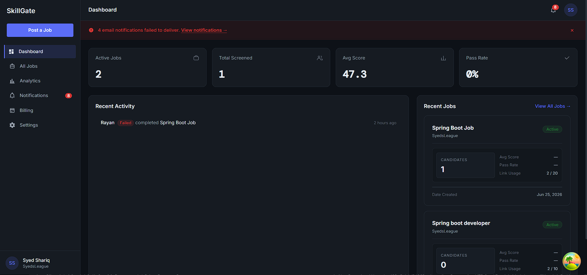

### Candidate Assessment (MCQ)

Candidates answer timed multiple-choice questions in a focused assessment flow with autosave support.

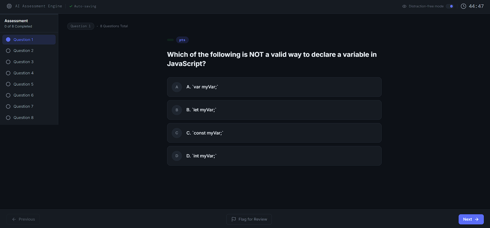

### Candidate Assessment (Text Question)

Text questions capture open-ended technical reasoning for AI-assisted evaluation.

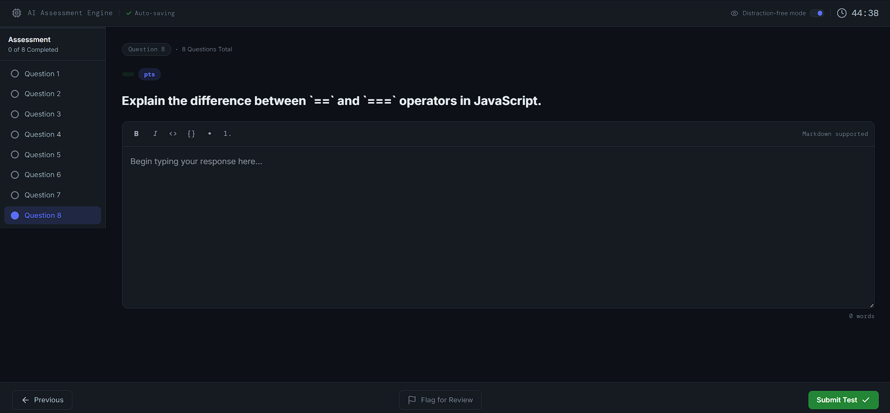

### Candidate Results

Candidates receive their score, question feedback, skill breakdown, and available report actions.

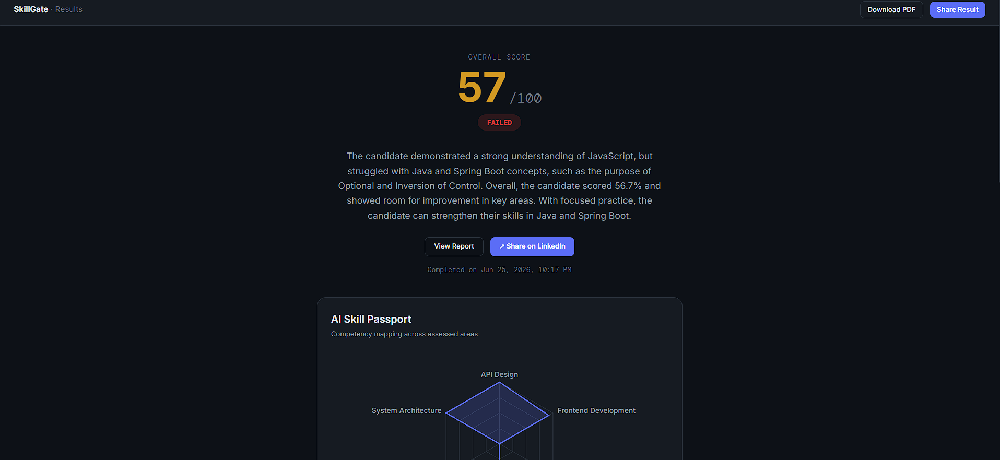

### AI Growth Roadmap

SkillGate turns assessment outcomes into a personalized learning roadmap with targeted next steps.

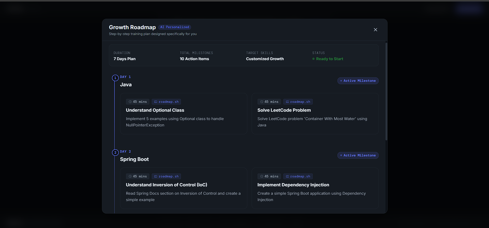

### Recruiter Candidate Profile

Recruiters can review candidate details, assessment outcomes, AI summaries, and hiring signals in one profile.

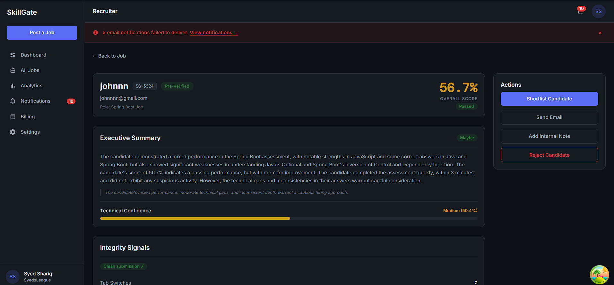

## Architecture Overview

The diagram below illustrates the complete end-to-end architecture of SkillGate, including the frontend, Supabase backend, Edge Functions, AI providers, storage, email, payments, and deployment infrastructure.

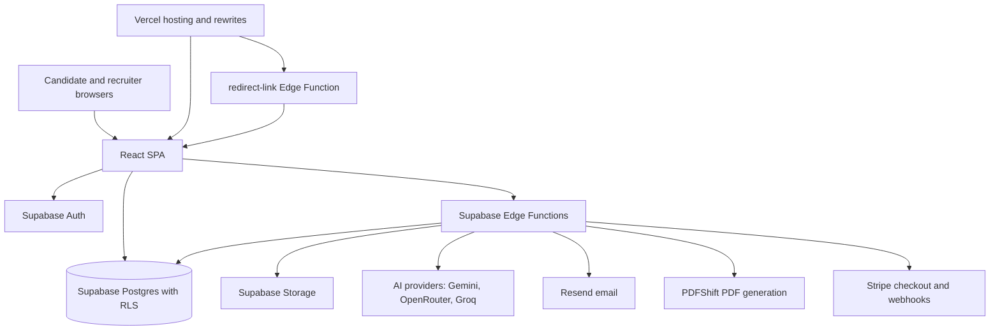

The frontend is a Vite React SPA. Authenticated recruiter data is primarily read through Supabase client queries protected by RLS. Candidate assessment operations use Edge Functions and signed assessment session tokens rather than direct anonymous table writes.

## High-Level System Design

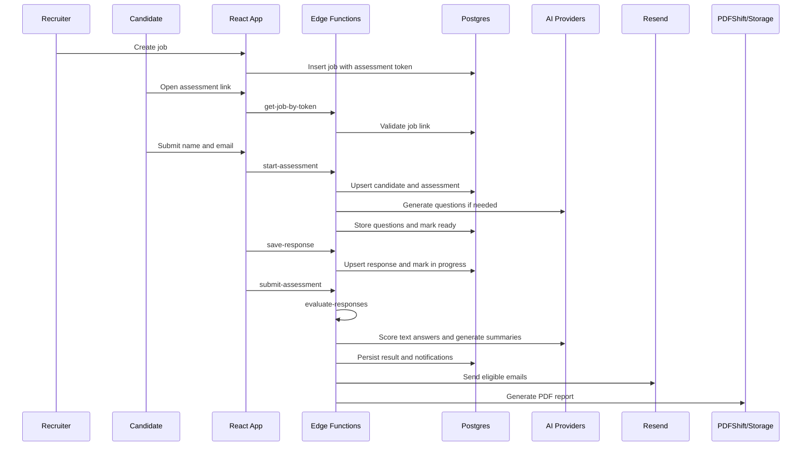

## Tech Stack

| Layer | Technology |
| --- | --- |
| Frontend | React 19, Vite 7, React Router 7 |
| Styling | Tailwind CSS 4, custom CSS theme tokens |
| Data fetching | TanStack Query 5 |
| Backend | Supabase Auth, Postgres, RLS, Storage, Edge Functions |
| Edge runtime | Deno TypeScript and JavaScript Edge Functions |
| AI providers | Gemini, OpenRouter, Groq fallback chain |
| Email | Resend |
| Payments | Stripe Checkout and Stripe webhooks |
| PDF | PDFShift plus Supabase Storage |
| Charts and utilities | Recharts, qrcode.react, react-hot-toast |
| Deployment | Vercel SPA hosting and Supabase Edge Functions |

## Folder Structure

```text
.
|-- public/                      Static public assets
|-- src/
|   |-- assets/                  App image assets
|   |-- components/              Shared UI, route guards, assessment, recruiter components
|   |-- config/                  Supabase browser client
|   |-- constants/               Plan, status, assessment constants
|   |-- context/                 AuthContext
|   |-- hooks/                   Auth, timer, anti-cheat, query hooks
|   |-- layouts/                 Recruiter dashboard layout
|   |-- lib/                     Query client and Supabase re-export
|   |-- pages/                   Public, auth, candidate, assessment, recruiter pages
|   |-- routes/                  React Router route map
|   |-- services/                Auth, assessment, recruiter, API client services
|   `-- test/                    Empty test placeholder
|-- supabase/
|   |-- functions/               Supabase Edge Functions
|   |-- migrations/              Historical migrations only
|   `-- config.toml              Local Supabase config
|-- remote_schema.sql            Current database source of truth
|-- vercel.json                  Vercel rewrites
|-- vite.config.js               Vite config
`-- package.json                 Scripts and dependencies
```

## Important Note

- `remote_schema.sql` is the authoritative production schema for this repository.
- Migration files are historical and may not reflect the current database.

## Database Overview

The current database schema is defined by `remote_schema.sql`. It contains 11 public tables:

| Table | Purpose |
| --- | --- |
| `profiles` | Recruiter profile, subscription, onboarding, approval, email verification, notification settings |
| `jobs` | Recruiter-owned roles and assessment-link settings |
| `candidates` | Candidate records scoped to a job and recruiter |
| `assessments` | Candidate assessment attempts, status, timing, anti-cheat counters, generation/evaluation attempts |
| `questions` | Generated or custom assessment questions tied to jobs and assessments |
| `responses` | Candidate answers, scoring, AI feedback, missed concepts |
| `results` | Overall score, pass state, confidence, summaries, resources, training plan, PDF metadata |
| `notifications` | Recruiter in-app notification records |
| `link_opens` | Hashed IP/user-agent tracking for public redirect links |
| `rate_limits` | Generic action rate-limit counters |
| `cache` | Cached generated data such as generated questions |
| `training_purchases` | Stripe-backed candidate training-plan purchases |

Important schema elements include:

| Type | Current details |
| --- | --- |
| Functions | `check_anon_rate_limit`, `increment_assessments_used`, `increment_job_link_use_count`, `increment_ratelimit`, `insert_questions_and_mark_ready`, `lock_assessment_question_generation`, `update_updated_at`, `verify_email_with_token`, `verify_email_debug`, `handle_new_user` |
| Triggers | `updated_at` triggers on assessments, candidates, jobs, profiles, responses, and results |
| Key constraints | Unique candidate email per job, unique active assessment per candidate/job for active statuses, unique response per assessment/question, unique result per assessment, unique assessment idempotency key |
| RLS | Enabled on all public tables listed in `remote_schema.sql` |
| Storage references | PDF report paths are stored in `results.pdf_storage_path` and read through signed URLs |

## Authentication Flow

```mermaid
flowchart TD
  Signup[Recruiter sign up] --> Supabase[Supabase Auth]
  Supabase --> Profile[profiles row]
  Signup --> Verification[send-verification-email Edge Function]
  Verification --> Email[Resend verification email]
  Email --> Confirm[/verify-email/confirm]
  Confirm --> RPC[verify_email_with_token RPC]
  RPC --> Onboarding[/onboarding]
  Onboarding --> Approval{account_status}
  Approval -->|approved| Dashboard[/dashboard]
  Approval -->|pending_approval| Pending[/pending-approval]
  Approval -->|rejected| Rejected[/rejected]
```

Protected recruiter routes require:

1. A valid Supabase Auth session.
2. `profiles.email_verified = true`.
3. `profiles.is_onboarded = true`.
4. `profiles.account_status = approved`.

The admin route requires `profiles.is_admin = true`.

## Recruiter Workflow

1. Register or log in at `/auth`.
2. Verify email through `/verify-email` and `/verify-email/confirm`.
3. Complete company onboarding at `/onboarding`.
4. Create a job at `/jobs/create`.
5. Share `/r/:token` or `/assess/:token` with candidates.
6. Monitor dashboard, jobs, analytics, notifications, billing, and settings.
7. Review candidate details at `/candidates/:candidateId`.
8. Shortlist or reject candidates individually or in bulk.
9. Retry failed evaluation or PDF generation from recruiter views where available.

## Candidate Workflow

1. Open an assessment link.
2. The app validates link status through `get-job-by-token`.
3. Candidate enters full name and email.
4. `start-assessment` creates or resumes candidate and assessment records.
5. Candidate receives a signed assessment session token stored in `sessionStorage`.
6. Questions are fetched through `get-assessment`.
7. Answers autosave through `save-response`; local fallback uses `localStorage`.
8. Candidate submits through `submit-assessment`.
9. Submitted page polls `get-candidate-result`.
10. Candidate sees score, feedback, question breakdown, PDF download when available, and growth roadmap.

## AI Evaluation Pipeline

### Question Generation

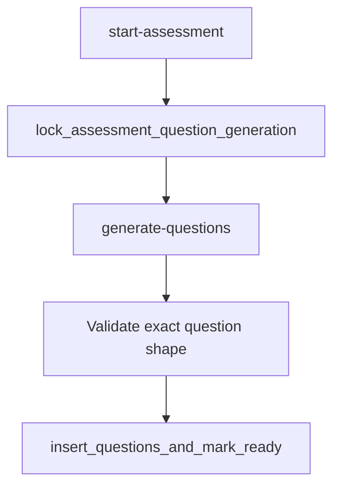

### Evaluation & Scoring

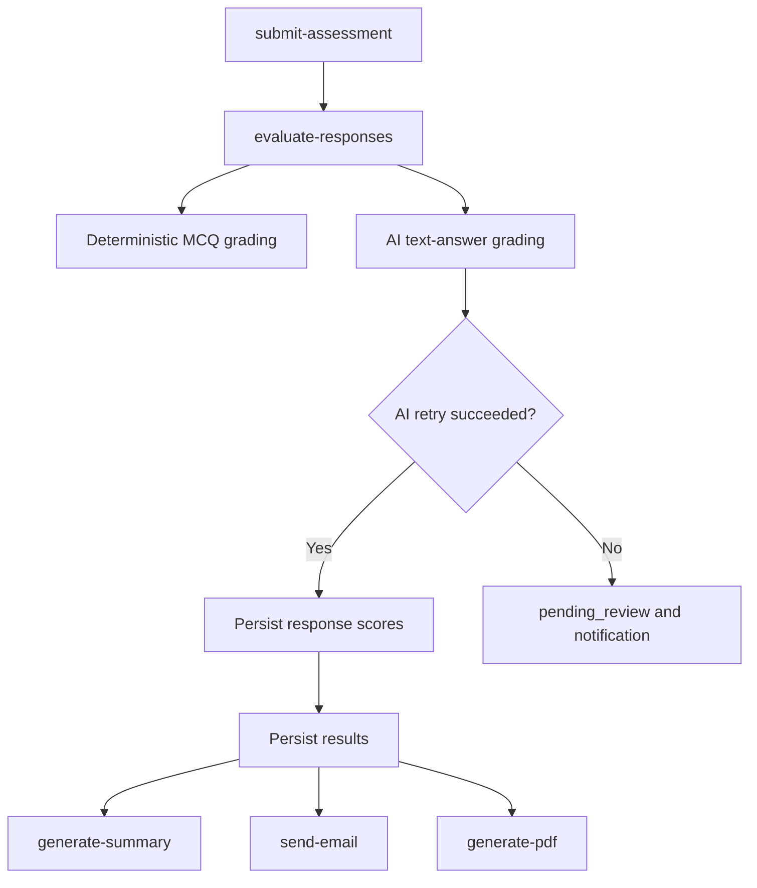

AI provider orchestration attempts Gemini first, OpenRouter second, and Groq third. The code validates returned JSON, applies fallback summaries when needed, and avoids using candidate responses as instructions in evaluation prompts.

## PDF Generation Pipeline

1. `generate-pdf` validates `assessmentId` and `resultId`.
2. It acquires a PDF generation lock by updating `results.pdf_status` to `generating`.
3. It fetches result, assessment, candidate, and job data.
4. It builds an HTML report.
5. It sends the HTML to PDFShift.
6. It uploads the returned PDF to the `reports` storage bucket.
7. It stores `pdf_status`, `pdf_storage_path`, and timestamps in `results`.
8. `get-pdf-url` validates the candidate session token and returns a 48-hour signed URL.
9. On first failure, generation is scheduled once more. On final failure, `pdf_generation_failed` notification is inserted.

## Notification System

Notifications are stored in `notifications` and read by recruiter query hooks. The recruiter layout shows recent notifications, unread count, failed email warning count, and a realtime Supabase channel that invalidates notification queries on insert.

Current notification types in the database are:

```text
email_sent
email_failed
candidate_passed
candidate_failed
assessment_complete
link_limit_reached
assessment_generation_failed
evaluation_pending_review
pdf_generation_failed
```

## Security Measures

| Measure | Implementation |
| --- | --- |
| RLS | Enabled on current public tables in `remote_schema.sql` |
| Recruiter ownership | Recruiter RLS policies scope jobs, candidates, assessments, questions, notifications to `auth.uid()` |
| Candidate session isolation | Candidate assessment APIs require signed HS256 session tokens with 4-hour expiration |
| Service-role boundary | Edge Functions use service-role Supabase clients for trusted backend operations |
| Link protection | Assessment links support active/inactive state, expiration, max-use counts, and redirect open logging |
| Input validation | Edge Functions validate UUIDs, email, method, required fields, answer length, time ranges, and event types |
| Prompt injection mitigation | Evaluation prompts explicitly treat candidate answers as untrusted data |
| Email verification | Custom verification token flow with 24-hour token expiry and 60-second resend cooldown |
| Stripe webhooks | Webhook signature verification with timestamp replay window |
| Signed PDFs | Candidate PDF downloads use short-lived signed storage URLs |
| Log redaction | Shared Edge Function logger redacts sensitive keys in structured logs |

## Anti-Cheat Features

| Feature | Behavior |
| --- | --- |
| Tab-switch tracking | Browser visibility changes increment `assessments.tab_switches` through `record-assessment-event` |
| Flagging | Assessments are flagged after 3 recorded tab switches |
| Paste prevention | Paste is blocked in assessment text inputs and recorded as `paste_attempts` |
| Copy/cut prevention | Copy and cut are prevented during assessment entry |
| Timer enforcement | Client timer auto-submits; `save-response` also rejects saves after the server-side time window |

## Error Recovery

| Area | Recovery behavior |
| --- | --- |
| Candidate answer saving | Local answer cache, pending-save queue, online/offline sync, retry before queueing |
| Assessment resume | Stored session allows return to active assessment |
| Assessment restart | One-time restart path for in-progress attempt number 1 |
| Question generation | Generation lock, AI retry, failed-assessment notification |
| Evaluation | Text-answer AI retry, pending-review status and recruiter alert when retries fail |
| Result polling | Candidate submitted page handles timeout, delayed review, and token errors |
| Email | One retry for retryable Resend failures and email success/failure notifications |
| PDF | Locking, stale generation recovery, one auto-retry, failure notification |
| UI runtime errors | App-level and section-level error boundaries |

## Environment Variables

Frontend variables:

```text
VITE_SUPABASE_URL
VITE_SUPABASE_ANON_KEY
VITE_CREATE_CHECKOUT_URL
VITE_STRIPE_TRAINING_PLAN_PRICE_ID
VITE_STRIPE_TRAINING_PLAN_PAYMENT_LINK
VITE_STRIPE_GROWTH_PRICE_ID
VITE_STRIPE_SCALE_PRICE_ID
```

Supabase Edge Function variables:

```text
SUPABASE_URL
SUPABASE_SERVICE_ROLE_KEY
SESSION_SIGNING_SECRET
SITE_URL
GEMINI_API_KEY
OPENROUTER_API_KEY
GROQ_API_KEY
RESEND_API_KEY
PDFSHIFT_API_KEY
STRIPE_SECRET_KEY
STRIPE_WEBHOOK_SECRET
STRIPE_STARTER_PRICE_ID
STRIPE_GROWTH_PRICE_ID
STRIPE_SCALE_PRICE_ID
STRIPE_TRAINING_PLAN_PRICE_ID
```

Supabase local config also references optional S3 variables:

```text
S3_ACCESS_KEY
S3_SECRET_KEY
```

## Local Setup

Prerequisites:

```text
Node.js
npm
Supabase project credentials
Supabase CLI for local Edge Function work
Stripe, Resend, PDFShift, and AI provider credentials for full integration testing
```

Install dependencies:

```bash
npm install
```

Create `.env.local` with the frontend variables listed above. Configure Supabase Edge Function secrets separately in the Supabase environment.

## Running the Project

Run the frontend locally:

```bash
npm run dev
```

Run linting:

```bash
npm run lint
```

Preview a production build locally:

```bash
npm run build
npm run preview
```

## Production Build

```bash
npm run build
```

The build output is generated in `dist/`.

## Deployment Notes

| Target | Notes |
| --- | --- |
| Vercel | `vercel.json` rewrites `/r/:token` to the Supabase `redirect-link` function and falls back all other paths to `/index.html` |
| Supabase | Deploy Edge Functions under `supabase/functions`; configure required secrets before deployment |
| Database | Use `remote_schema.sql` as current schema documentation. Historical migrations may not match the current remote state |
| Storage | PDF generation expects a `reports` bucket. Logo upload code expects a `logos` bucket |
| Email | Current email sender is `onboarding@resend.dev`; production should use a verified sending domain |
| Stripe | Checkout and webhook functions require consistent price IDs and webhook secret configuration |

## Edge Functions Overview

| Function | Purpose |
| --- | --- |
| `get-job-by-token` | Validates public assessment link token and returns candidate-safe job data |
| `redirect-link` | Tracks hashed link opens and redirects `/r/:token` traffic to the candidate assessment page |
| `start-assessment` | Upserts candidate, creates or resumes assessment, generates questions when needed, signs session token |
| `generate-questions` | Generates, validates, caches, and stores assessment questions |
| `get-assessment` | Returns candidate-safe assessment state and questions for a signed session |
| `save-response` | Validates signed session and upserts a candidate response |
| `record-assessment-event` | Records tab switches and paste attempts |
| `restart-assessment` | Clears responses and restarts an in-progress first attempt |
| `submit-assessment` | Marks assessment submitted, increments usage, schedules evaluation |
| `evaluate-responses` | Scores responses, persists results, schedules email, summary, and PDF work |
| `generate-summary` | Enriches result with feedback, resources, executive summary, hiring signal, and training plan |
| `get-candidate-result` | Returns candidate-safe result data for polling and result pages |
| `generate-pdf` | Builds and stores PDF report |
| `get-pdf-url` | Returns signed PDF URL for validated candidate sessions |
| `send-email` | Sends result and recruiter emails, plus pending-review email |
| `send-verification-email` | Sends account verification email with cooldown and authorization checks |
| `create-checkout` | Creates Stripe Checkout sessions for authenticated recruiters |
| `stripe-webhook` | Handles Stripe subscription, payment, and failure events |

## API Overview

The frontend does not define a separate REST server. It uses:

| API surface | Used for |
| --- | --- |
| Supabase Auth | Recruiter signup, login, logout, password reset, password update |
| Supabase PostgREST | Authenticated recruiter CRUD and analytics under RLS |
| Supabase RPC | Email verification and backend utility functions |
| Supabase Edge Functions | Candidate assessment workflow, AI, email, PDF, Stripe integration |
| Supabase Storage | Company logos and generated PDF reports |

## Database Schema Summary

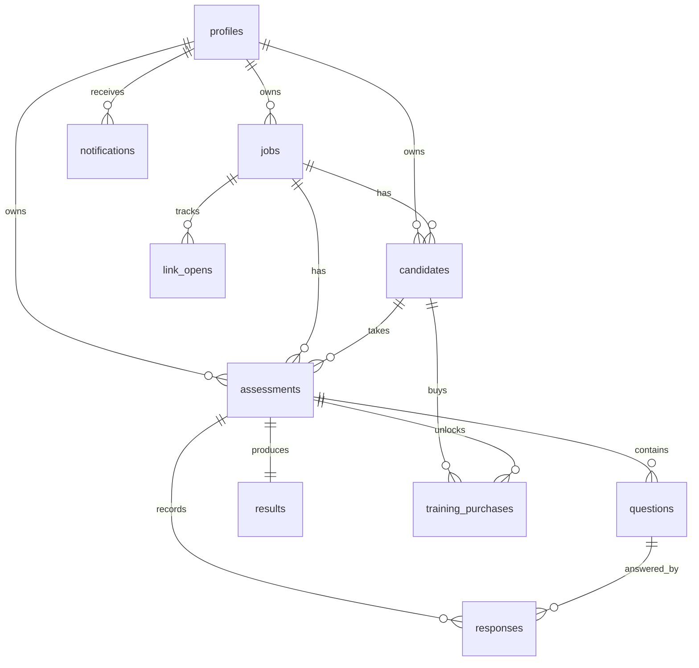

Key status values:

| Entity | Values |
| --- | --- |
| `assessments.status` | `pending`, `generating`, `ready`, `in_progress`, `submitted`, `evaluating`, `completed`, `failed`, `pending_review` |
| `candidates.status` | `pending`, `in_progress`, `completed`, `shortlisted`, `rejected` |
| `profiles.account_status` | `approved`, `pending_approval`, `rejected` |
| `profiles.subscription_tier` | `starter`, `growth`, `scale` |
| `questions.question_type` | `mcq`, `text` |
| `results.pdf_status` | `pending`, `generating`, `generated`, `failed` |
| `training_purchases.status` | `pending`, `completed`, `failed`, `refunded` |

## Design Decisions

| Decision | Rationale visible in the codebase |
| --- | --- |
| Candidate workflow behind Edge Functions | Keeps candidate assessment writes behind signed session validation instead of direct anonymous table access |
| Signed session token separate from Supabase Auth | Candidates do not need recruiter-style accounts to complete assessments |
| Service-role Edge Functions | Complex AI, email, Stripe, and PDF operations require trusted backend access |
| RLS for recruiter data | Authenticated recruiter reads and writes are scoped by `recruiter_id` policies |
| Local answer persistence | Candidate assessment pages use `localStorage` and pending queues to reduce data loss during network instability |
| AI provider fallback | Question generation, scoring, and summaries can fall back across multiple model providers |
| PDF generation as async workflow | Result pages and emails can proceed while PDF status transitions independently |
| Account approval gate | Consumer email domains are treated as pending approval by the schema function |

## Future Roadmap

See `v2.txt` for the CTO-level Version 2 roadmap.

## License

No license file is currently present in this repository. Add a `LICENSE` file before distributing or accepting external contributions.

