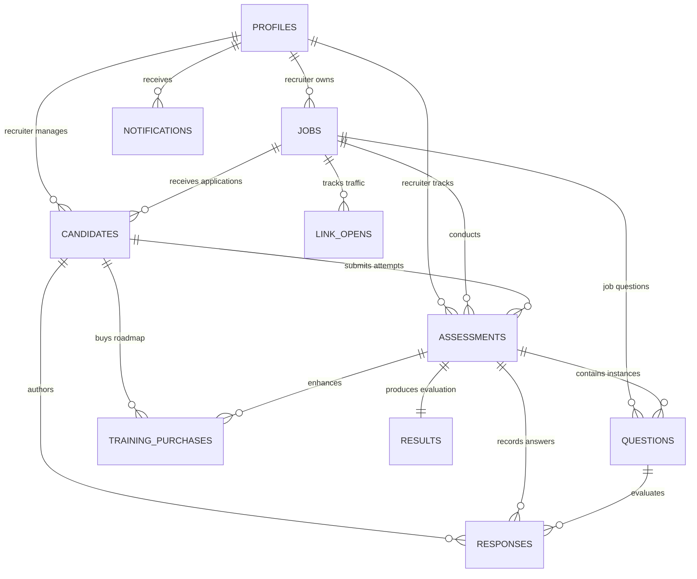

# 03. Database Schema, Relationships & Row-Level Security

The authoritative production schema is defined in `remote_schema.sql`. The database consists of 12 public tables, 10 PostgreSQL functions/RPCs, and comprehensive Row-Level Security (RLS) policies enforcing multi-tenant isolation.

---

## 1. Entity-Relationship (ER) Diagram



---

## 2. Table-by-Table Technical Reference

### 1. `profiles`
Tracks recruiter accounts, subscription tier limits, onboarding stage, account approvals, and email verification.

* **Primary Key:** `id` (`uuid`), foreign key referencing `auth.users(id) ON DELETE CASCADE`.
* **Triggers:** `trg_profiles_updated` executes `update_updated_at()` before update.

| Column | Type | Nullable | Default | Constraints & Description |
| :--- | :--- | :--- | :--- | :--- |
| `id` | `uuid` | NO | — | PK, references `auth.users(id) ON DELETE CASCADE` |
| `email` | `text` | NO | `''` | Recruiter account email |
| `full_name` | `text` | YES | `NULL` | Recruiter full name |
| `company_name` | `text` | YES | `NULL` | Company name (collected during onboarding) |
| `company_website` | `text` | YES | `NULL` | Company website URL |
| `company_logo_url` | `text` | YES | `NULL` | Storage URL for company logo |
| `work_email` | `text` | YES | `NULL` | Secondary corporate email |
| `subscription_tier` | `text` | NO | `'starter'` | `CHECK (subscription_tier IN ('starter', 'growth', 'scale'))` |
| `assessments_used` | `integer` | NO | `0` | Running total of assessments taken under this recruiter's jobs |
| `assessments_limit` | `integer` | NO | `10` | Maximum assessments allowed under current plan |
| `stripe_customer_id`| `text` | YES | `NULL` | Stripe customer identifier (`cus_...`) |
| `billing_cycle_reset_at` | `timestamptz` | YES | `NULL` | Billing reset timestamp |
| `notify_on_every_completion` | `boolean` | NO | `false` | Email alert toggle: notify on all test completions |
| `notify_on_pass_only` | `boolean` | NO | `false` | Email alert toggle: notify only when candidate passes |
| `notify_inapp` | `boolean` | NO | `true` | In-app dashboard notification toggle |
| `zapier_webhook_url` | `text` | YES | `NULL` | Custom webhook endpoint for Zapier |
| `is_onboarded` | `boolean` | NO | `false` | True when recruiter completes company onboarding |
| `is_admin` | `boolean` | NO | `false` | Platform administrator flag |
| `account_status` | `text` | NO | `'approved'` | `CHECK (account_status IN ('approved', 'pending_approval', 'rejected'))` |
| `email_verified` | `boolean` | NO | `false` | Profile email verification flag |
| `email_verification_token` | `text` | YES | `NULL` | Random UUID token for email verification link |
| `email_verification_sent_at` | `timestamptz` | YES | `NULL` | Timestamp when verification email was dispatched (used for 60s cooldown) |
| `email_verified_at` | `timestamptz` | YES | `NULL` | Timestamp when verification was confirmed |
| `created_at` | `timestamptz` | NO | `now()` | Row creation timestamp |
| `updated_at` | `timestamptz` | NO | `now()` | Managed automatically by `trg_profiles_updated` |

* **Indexes & Constraints:**
  * `profiles_pkey` PRIMARY KEY (`id`)
  * `idx_profiles_email_verification_token` UNIQUE (`email_verification_token`) WHERE `email_verification_token IS NOT NULL`
* **RLS Policies:**
  * `profile_owner`: `TO authenticated USING (auth.uid() = id) WITH CHECK (auth.uid() = id)` (Recruiters manage own profile).
  * `Public can read recruiter limit for assessment check`: `FOR SELECT USING (true)` (Allows unauthenticated candidate check of `assessments_used` vs. `assessments_limit`).
  * `admin_can_update_any_profile`: `FOR UPDATE USING (EXISTS (SELECT 1 FROM profiles WHERE id = auth.uid() AND is_admin = true)) WITH CHECK (EXISTS (SELECT 1 FROM profiles WHERE id = auth.uid() AND is_admin = true))` (Allows platform admin to approve/reject accounts).

---

### 2. `jobs`
Job openings created by recruiters with assessment configuration rules.

* **Primary Key:** `id` (`uuid`, default `gen_random_uuid()`).
* **Triggers:** `trg_jobs_updated` executes `update_updated_at()`.

| Column | Type | Nullable | Default | Constraints & Description |
| :--- | :--- | :--- | :--- | :--- |
| `id` | `uuid` | NO | `gen_random_uuid()` | PK |
| `recruiter_id` | `uuid` | NO | — | FK referencing `profiles(id) ON DELETE RESTRICT` |
| `title` | `text` | NO | — | Role title (e.g. "Senior React Engineer") |
| `company_name` | `text` | NO | — | Company name displaying to candidate |
| `description` | `text` | NO | — | Role description used in AI prompt context |
| `skills` | `jsonb` | NO | `'[]'` | JSON array of skills: `[{"name": "React", "level": "Advanced"}]` |
| `min_score_threshold` | `integer` | NO | `70` | `CHECK (min_score_threshold >= 50 AND min_score_threshold <= 90)` |
| `time_limit_minutes` | `integer` | NO | `30` | Assessment duration limit |
| `is_active` | `boolean` | NO | `true` | Recruiter toggle to enable/disable assessment link |
| `allow_retakes` | `boolean` | NO | `false` | Whether candidates can attempt test again after completion |
| `show_score_to_candidate` | `boolean` | NO | `true` | Toggle candidate visibility of overall score and radar chart |
| `assessment_link_token` | `text` | YES | `NULL` | Unique token used in `/assess/:token` links |
| `link_expires_at` | `timestamptz` | YES | `NULL` | Optional link expiration timestamp |
| `link_max_uses` | `integer` | YES | `NULL` | Maximum number of candidates allowed to start the test |
| `link_use_count` | `integer` | NO | `0` | Running counter of link usages incremented via RPC |
| `created_at` | `timestamptz` | NO | `now()` | Timestamp created |
| `updated_at` | `timestamptz` | NO | `now()` | Managed automatically by `trg_jobs_updated` |

* **Indexes & Constraints:**
  * `jobs_pkey` PRIMARY KEY (`id`)
  * `jobs_assessment_link_token_key` UNIQUE (`assessment_link_token`)
  * `idx_jobs_recruiter` on `recruiter_id`
  * `idx_jobs_token` on `assessment_link_token`
* **RLS Policies:**
  * `recruiter_all_jobs`: `TO authenticated USING (auth.uid() = recruiter_id) WITH CHECK (auth.uid() = recruiter_id)`.

---

### 3. `candidates`
Candidate records scoped to a job and a recruiter.

* **Primary Key:** `id` (`uuid`, default `gen_random_uuid()`).
* **Triggers:** `trg_candidates_updated` executes `update_updated_at()`.

| Column | Type | Nullable | Default | Constraints & Description |
| :--- | :--- | :--- | :--- | :--- |
| `id` | `uuid` | NO | `gen_random_uuid()` | PK |
| `job_id` | `uuid` | NO | — | FK referencing `jobs(id) ON DELETE RESTRICT` |
| `recruiter_id` | `uuid` | NO | — | FK referencing `profiles(id) ON DELETE RESTRICT` |
| `full_name` | `text` | NO | — | Candidate full name |
| `email` | `text` | NO | — | Candidate email address |
| `status` | `text` | NO | `'pending'` | `CHECK (status IN ('pending', 'in_progress', 'completed', 'shortlisted', 'rejected'))` |
| `created_at` | `timestamptz` | NO | `now()` | Timestamp registered |
| `updated_at` | `timestamptz` | NO | `now()` | Managed automatically by `trg_candidates_updated` |

* **Indexes & Constraints:**
  * `candidates_pkey` PRIMARY KEY (`id`)
  * `candidates_email_job_id_unique` UNIQUE (`email`, `job_id`)
  * `idx_candidates_unique_email_job` UNIQUE (`lower(email)`, `job_id`)
  * `idx_candidates_unique_email_job_exact` UNIQUE (`email`, `job_id`)
  * `idx_candidates_lookup` on (`lower(email)`, `job_id`)
  * `idx_candidates_recruiter` on `recruiter_id`
* **RLS Policies:**
  * `recruiter_all_candidates`: `TO authenticated USING (auth.uid() = recruiter_id) WITH CHECK (auth.uid() = recruiter_id)`.

---

### 4. `assessments`
Candidate assessment sessions, execution states, timers, anti-cheat telemetry, and retry counters.

* **Primary Key:** `id` (`uuid`, default `gen_random_uuid()`).
* **Triggers:** `trg_assessments_updated` executes `update_updated_at()`.

| Column | Type | Nullable | Default | Constraints & Description |
| :--- | :--- | :--- | :--- | :--- |
| `id` | `uuid` | NO | `gen_random_uuid()` | PK |
| `job_id` | `uuid` | NO | — | FK referencing `jobs(id) ON DELETE RESTRICT` |
| `candidate_id` | `uuid` | NO | — | FK referencing `candidates(id) ON DELETE RESTRICT` |
| `recruiter_id` | `uuid` | NO | — | FK referencing `profiles(id) ON DELETE RESTRICT` |
| `attempt_number` | `integer` | NO | `1` | Attempt number (1 or 2) |
| `status` | `text` | NO | `'pending'` | `CHECK (status IN ('pending', 'generating', 'ready', 'in_progress', 'submitted', 'evaluating', 'completed', 'failed', 'pending_review'))` |
| `started_at` | `timestamptz` | YES | `NULL` | First answer timestamp (starts countdown) |
| `submitted_at` | `timestamptz` | YES | `NULL` | Submission timestamp |
| `completed_at` | `timestamptz` | YES | `NULL` | AI evaluation completion timestamp |
| `time_limit_minutes` | `integer` | NO | `30` | Maximum minutes allocated |
| `generation_attempts` | `integer` | NO | `0` | Concurrency lock for question generation |
| `evaluation_attempts` | `integer` | NO | `0` | Grading attempt counter |
| `tab_switches` | `integer` | NO | `0` | Tab-switch counter recorded by anti-cheat |
| `paste_attempts` | `integer` | NO | `0` | Intercepted paste attempts recorded by anti-cheat |
| `is_flagged` | `boolean` | NO | `false` | Set to true when `tab_switches >= 3` |
| `idempotency_key` | `text` | YES | `NULL` | Unique key preventing duplicate creation |
| `created_at` | `timestamptz` | NO | `now()` | Row creation timestamp |
| `updated_at` | `timestamptz` | NO | `now()` | Managed automatically by `trg_assessments_updated` |

* **Indexes & Constraints:**
  * `assessments_pkey` PRIMARY KEY (`id`)
  * `assessments_idempotency_key_key` UNIQUE (`idempotency_key`)
  * `unique_attempt` UNIQUE (`candidate_id`, `job_id`, `attempt_number`)
  * `idx_assessments_one_active_per_candidate_job` UNIQUE (`candidate_id`, `job_id`) WHERE `status IN ('pending', 'ready', 'in_progress')`
  * `idx_assessments_candidate` on `candidate_id`
  * `idx_assessments_job` on `job_id`
  * `idx_assessments_status` on `status`
* **RLS Policies:**
  * `recruiter_all_assessments`: `TO authenticated USING (auth.uid() = recruiter_id) WITH CHECK (auth.uid() = recruiter_id)`.

---

### 5. `questions`
Technical screening questions generated for specific assessments or jobs. Exactly 8 questions per assessment (5 MCQ, 3 Text).

* **Primary Key:** `id` (`uuid`, default `gen_random_uuid()`).

| Column | Type | Nullable | Default | Constraints & Description |
| :--- | :--- | :--- | :--- | :--- |
| `id` | `uuid` | NO | `gen_random_uuid()` | PK |
| `job_id` | `uuid` | NO | — | FK referencing `jobs(id) ON DELETE RESTRICT` |
| `recruiter_id` | `uuid` | NO | — | FK referencing `profiles(id) ON DELETE RESTRICT` |
| `assessment_id` | `uuid` | YES | `NULL` | FK referencing `assessments(id) ON DELETE CASCADE` |
| `question_text` | `text` | NO | — | The actual question prompt |
| `question_type` | `text` | NO | — | `CHECK (question_type IN ('mcq', 'text'))` |
| `skill` | `text` | NO | — | Specific skill tested (e.g. "React", "PostgreSQL") |
| `difficulty` | `text` | NO | `'medium'` | `CHECK (difficulty IN ('easy', 'medium', 'hard'))` |
| `options` | `jsonb` | YES | `NULL` | 4 option strings for MCQ: `["A", "B", "C", "D"]` |
| `correct_answer` | `text` | YES | `NULL` | Exact matching string from `options` for MCQ |
| `ideal_answer` | `text` | YES | `NULL` | Grading rubric / model answer for text questions |
| `points` | `integer` | NO | `10` | `CHECK (points IN (10, 20, 30))` |
| `order_index` | `integer` | NO | `0` | Question presentation sequence (0 to 7) |
| `is_custom` | `boolean` | NO | `false` | True if manually supplied rather than AI-generated |
| `created_at` | `timestamptz` | NO | `now()` | Row creation timestamp |

* **Complex Schema Check Constraint:**
  ```sql
  CONSTRAINT questions_check CHECK (
    (question_type = 'mcq' AND options IS NOT NULL AND jsonb_array_length(options) = 4 AND correct_answer IS NOT NULL AND options ? correct_answer)
    OR
    (question_type = 'text' AND ideal_answer IS NOT NULL)
  )
  ```
* **Indexes & Constraints:**
  * `questions_pkey` PRIMARY KEY (`id`)
  * `idx_questions_job` on `job_id`
* **RLS Policies:**
  * `recruiter_all_questions`: `TO authenticated USING (auth.uid() = recruiter_id) WITH CHECK (auth.uid() = recruiter_id)`.

---

### 6. `responses`
Candidate submitted answers, real-time autosaves, and automated scoring breakdown.

* **Primary Key:** `id` (`uuid`, default `gen_random_uuid()`).
* **Triggers:** `trg_responses_updated` executes `update_updated_at()`.

| Column | Type | Nullable | Default | Constraints & Description |
| :--- | :--- | :--- | :--- | :--- |
| `id` | `uuid` | NO | `gen_random_uuid()` | PK |
| `assessment_id` | `uuid` | NO | — | FK referencing `assessments(id) ON DELETE RESTRICT` |
| `question_id` | `uuid` | NO | — | FK referencing `questions(id) ON DELETE RESTRICT` |
| `candidate_id` | `uuid` | NO | — | FK referencing `candidates(id) ON DELETE RESTRICT` |
| `answer_given` | `text` | YES | `NULL` | Candidate's answer text or selected MCQ option |
| `is_correct` | `boolean` | YES | `NULL` | Boolean accuracy flag (Text answers: `score >= 0.7`) |
| `score` | `numeric(5,2)` | YES | `NULL` | Clamped score: `CHECK (score >= 0.0 AND score <= 1.0)` |
| `points_earned` | `integer` | YES | `0` | Calculated as `points * score` |
| `ai_feedback` | `text` | YES | `NULL` | 2-3 sentence AI evaluation |
| `missed_concepts` | `jsonb` | YES | `'[]'` | JSON array of missed technical concepts |
| `time_taken_seconds` | `integer` | YES | `0` | Time spent on this individual question |
| `created_at` | `timestamptz` | NO | `now()` | Timestamp created |
| `updated_at` | `timestamptz` | NO | `now()` | Managed automatically by `trg_responses_updated` |

* **Indexes & Constraints:**
  * `responses_pkey` PRIMARY KEY (`id`)
  * `responses_assessment_id_question_id_key` UNIQUE (`assessment_id`, `question_id`)
  * `idx_responses_assessment` on `assessment_id`
* **RLS Policies:**
  * `recruiter_read_responses`: `FOR SELECT TO authenticated USING (assessment_id IN (SELECT id FROM assessments WHERE recruiter_id = auth.uid()))`.

---

### 7. `results`
Final candidate score, pass/fail state, skill breakdown, executive summary, training roadmap, and PDF export metadata.

* **Primary Key:** `id` (`uuid`, default `gen_random_uuid()`).
* **Triggers:** `trg_results_updated` and `trg_results_updated_at` execute `update_updated_at()`.

| Column | Type | Nullable | Default | Constraints & Description |
| :--- | :--- | :--- | :--- | :--- |
| `id` | `uuid` | NO | `gen_random_uuid()` | PK |
| `assessment_id` | `uuid` | NO | — | Unique FK referencing `assessments(id) ON DELETE RESTRICT` |
| `overall_score` | `numeric(5,2)` | NO | `0` | Percentage score (0.00 to 100.00) |
| `passed` | `boolean` | NO | `false` | True if `overall_score >= jobs.min_score_threshold` |
| `confidence_score` | `numeric(5,2)` | YES | `0` | Score validity percentage (penalized by anti-cheat) |
| `confidence_label` | `text` | YES | `'Low'` | `CHECK (confidence_label IN ('High', 'Medium', 'Low'))` |
| `skill_scores` | `jsonb` | YES | `'[]'` | Skill score objects: `[{"skill": "React", "score": 85, "earned": 17, "possible": 20}]` |
| `total_points_earned` | `integer` | YES | `0` | Sum of points earned across all 8 questions |
| `total_points_possible` | `integer` | YES | `0` | Maximum possible points (150 for 8 questions) |
| `time_taken_seconds` | `integer` | YES | `0` | Total test duration in seconds |
| `feedback_summary` | `text` | YES | `NULL` | Candidate-facing evaluation summary |
| `improvement_resources` | `jsonb` | YES | `'[]'` | Curated learning topics: concept, practice, project |
| `executive_summary` | `text` | YES | `NULL` | Recruiter-facing technical summary |
| `hiring_signal` | `text` | YES | `NULL` | `CHECK (hiring_signal IN ('Strong Yes', 'Maybe', 'No'))` |
| `hiring_rationale` | `text` | YES | `NULL` | Deep hiring recommendation text |
| `strengths` | `jsonb` | YES | `'[]'` | String array of candidate strengths |
| `weaknesses` | `jsonb` | YES | `'[]'` | String array of improvement areas |
| `training_plan` | `jsonb` | YES | `'[]'` | Multi-day roadmap with daily tasks and durations |
| `pdf_url` | `text` | YES | `NULL` | Legacy direct PDF URL reference |
| `pdf_status` | `text` | YES | `'pending'` | `CHECK (pdf_status IN ('pending', 'generating', 'generated', 'failed'))` |
| `pdf_storage_path` | `text` | YES | `NULL` | Supabase Storage bucket path (`<candidateId>/<uuid>.pdf`) |
| `pdf_generated_at` | `timestamptz` | YES | `NULL` | Completion timestamp of PDFShift generation |
| `pdf_error` | `text` | YES | `NULL` | Error message if PDFShift or upload fails |
| `pdf_generation_started_at` | `timestamptz` | YES | `NULL` | Lock acquisition timestamp (10-minute stale cutoff) |
| `pdf_generation_attempts` | `integer` | NO | `0` | Retry counter (max 1 retry) |
| `email_sent` | `boolean` | NO | `false` | True when result email has been dispatched via Resend |
| `summary_generated` | `boolean` | NO | `false` | True when AI summary pipeline completes |
| `summary_generated_at` | `timestamptz` | YES | `NULL` | AI summary completion timestamp |
| `summary_model` | `text` | YES | `NULL` | Name of AI model that generated summary |
| `summary_prompt_version` | `text` | YES | `NULL` | Prompt version tag |
| `created_at` | `timestamptz` | NO | `now()` | Row creation timestamp |
| `updated_at` | `timestamptz` | NO | `now()` | Managed automatically by trigger |

* **Indexes & Constraints:**
  * `results_pkey` PRIMARY KEY (`id`)
  * `results_assessment_id_key` UNIQUE (`assessment_id`)
  * `idx_results_assessment` on `assessment_id`
* **RLS Policies:**
  * `recruiter_read_results`: `FOR SELECT TO authenticated USING (assessment_id IN (SELECT id FROM assessments WHERE recruiter_id = auth.uid()))`.

---

### 8. `notifications`
In-app alerts delivered to recruiters via Supabase Realtime CDC channels.

* **Primary Key:** `id` (`uuid`, default `gen_random_uuid()`).

| Column | Type | Nullable | Default | Constraints & Description |
| :--- | :--- | :--- | :--- | :--- |
| `id` | `uuid` | NO | `gen_random_uuid()` | PK |
| `recruiter_id` | `uuid` | NO | — | FK referencing `profiles(id) ON DELETE CASCADE` |
| `type` | `text` | NO | — | See check constraint below |
| `title` | `text` | NO | — | Notification title |
| `message` | `text` | NO | — | Notification body content |
| `candidate_id` | `uuid` | YES | `NULL` | FK referencing `candidates(id) ON DELETE SET NULL` |
| `assessment_id` | `uuid` | YES | `NULL` | FK referencing `assessments(id) ON DELETE SET NULL` |
| `job_id` | `uuid` | YES | `NULL` | FK referencing `jobs(id) ON DELETE SET NULL` |
| `is_read` | `boolean` | NO | `false` | Read status toggle |
| `created_at` | `timestamptz` | NO | `now()` | Row creation timestamp |

* **Type Check Constraint:**
  ```sql
  CONSTRAINT notifications_type_check CHECK (
    type IN (
      'email_sent',
      'email_failed',
      'candidate_passed',
      'candidate_failed',
      'assessment_complete',
      'link_limit_reached',
      'assessment_generation_failed',
      'evaluation_pending_review',
      'pdf_generation_failed'
    )
  )
  ```
* **Indexes & Constraints:**
  * `notifications_pkey` PRIMARY KEY (`id`)
  * `idx_notifications_recruiter` on `recruiter_id`
  * `idx_notifications_unread` on (`recruiter_id`, `is_read`)
* **RLS Policies:**
  * `recruiter_all_notifications`: `TO authenticated USING (auth.uid() = recruiter_id) WITH CHECK (auth.uid() = recruiter_id)`.

---

### 9. `link_opens`
Privacy-preserving link open telemetry tracking traffic per job link.

* **Primary Key:** `id` (`uuid`, default `gen_random_uuid()`).

| Column | Type | Nullable | Default | Description |
| :--- | :--- | :--- | :--- | :--- |
| `id` | `uuid` | NO | `gen_random_uuid()` | PK |
| `job_id` | `uuid` | NO | — | FK referencing `jobs(id) ON DELETE CASCADE` |
| `opened_at` | `timestamptz` | YES | `now()` | Open event timestamp |
| `ip_hash` | `text` | YES | `NULL` | First 16 chars of SHA-256 hash of client IP |
| `user_agent_hash`| `text` | YES | `NULL` | First 16 chars of SHA-256 hash of User-Agent |

* **Indexes & Constraints:**
  * `link_opens_pkey` PRIMARY KEY (`id`)
  * `link_opens_job_id_idx` on `job_id`
* **RLS Policies:**
  * `Recruiters can read link opens for their jobs`: `FOR SELECT TO authenticated USING (job_id IN (SELECT id FROM jobs WHERE recruiter_id = auth.uid()))`.
  * `Service role can insert link opens`: `FOR INSERT WITH CHECK (true)` (Used by `redirect-link` Edge Function).

---

### 10. `rate_limits`
Composite key sliding-window rate limit counters for IP and action buckets.

* **Primary Key:** Composite (`identifier`, `action`, `window_start`).

| Column | Type | Nullable | Default | Description |
| :--- | :--- | :--- | :--- | :--- |
| `identifier` | `text` | NO | — | IP address or client ID |
| `action` | `text` | NO | — | Action name (e.g. `'candidate_insert'`, `'ai_questions'`) |
| `window_start` | `timestamptz` | NO | — | Start of UTC bucket window |
| `count` | `integer` | NO | `1` | Number of events recorded in this window |
| `created_at` | `timestamptz` | NO | `now()` | Row creation timestamp |

* **Indexes & Constraints:**
  * `rate_limits_pkey` PRIMARY KEY (`identifier`, `action`, `window_start`)
* **RLS Policies:**
  * `deny_rate_limits_anon`: `TO anon USING (false)`.
  * `deny_rate_limits_authenticated`: `TO authenticated USING (false)` (Internal access only via `increment_ratelimit` RPC).

---

### 11. `cache`
Database-backed cache for AI-generated question sets to save token costs and reduce latency.

* **Primary Key:** `id` (`uuid`, default `gen_random_uuid()`).

| Column | Type | Nullable | Default | Description |
| :--- | :--- | :--- | :--- | :--- |
| `id` | `uuid` | NO | `gen_random_uuid()` | PK |
| `cache_key` | `text` | NO | — | SHA-256 hash of job title + skills |
| `cache_type` | `text` | NO | — | Cache category (e.g. `'ai_questions'`) |
| `data` | `jsonb` | NO | — | Cached question payload |
| `expires_at` | `timestamptz` | NO | — | Expiration timestamp (TTL) |
| `created_at` | `timestamptz` | NO | `now()` | Row creation timestamp |

* **Indexes & Constraints:**
  * `cache_pkey` PRIMARY KEY (`id`)
  * `cache_cache_key_key` UNIQUE (`cache_key`)
  * `idx_cache_key` on `cache_key`
  * `idx_cache_expires` and `idx_cache_expires_at` on `expires_at`
* **RLS Policies:**
  * `deny_cache_anon`: `TO anon USING (false)`.
  * `deny_cache_authenticated`: `TO authenticated USING (false)`.

---

### 12. `training_purchases`
Stripe purchases by candidates to unlock full AI Growth Roadmaps ($9.00).

* **Primary Key:** `id` (`uuid`, default `gen_random_uuid()`).

| Column | Type | Nullable | Default | Constraints & Description |
| :--- | :--- | :--- | :--- | :--- |
| `id` | `uuid` | NO | `gen_random_uuid()` | PK |
| `candidate_id` | `uuid` | NO | — | FK referencing `candidates(id) ON DELETE RESTRICT` |
| `assessment_id` | `uuid` | NO | — | FK referencing `assessments(id) ON DELETE RESTRICT` |
| `stripe_session_id` | `text` | YES | `NULL` | Stripe Checkout session ID (`cs_test_...`) |
| `amount_paid` | `integer` | NO | `900` | Amount paid in cents ($9.00) |
| `currency` | `text` | NO | `'usd'` | Currency code |
| `status` | `text` | NO | `'pending'` | `CHECK (status IN ('pending', 'completed', 'failed', 'refunded'))` |
| `created_at` | `timestamptz` | NO | `now()` | Row creation timestamp |

* **Indexes & Constraints:**
  * `training_purchases_pkey` PRIMARY KEY (`id`)
  * `training_purchases_stripe_session_id_key` UNIQUE (`stripe_session_id`)
* **RLS Policies:**
  * `Candidates can check their purchase`: `FOR SELECT USING (true)`.
  * `recruiter_read_purchases`: `FOR SELECT TO authenticated USING (assessment_id IN (SELECT id FROM assessments WHERE recruiter_id = auth.uid()))`.
  * `anon_insert_training_purchase`: `FOR INSERT TO anon WITH CHECK (assessment_id IN (SELECT a.id FROM assessments a JOIN jobs j ON j.id = a.job_id WHERE j.assessment_link_token IS NOT NULL AND a.status = 'completed'))`.

---

## 3. Stored Database Functions & RPCs

All stored procedures use `SECURITY DEFINER` with fixed search paths to prevent search-path hijacking attacks.

### 1. `check_anon_rate_limit()`
* **Signature:** `() RETURNS boolean`
* **Purpose:** Inspects `x-real-ip` or `x-forwarded-for` request headers from PostgREST context. Bockets by hour and returns `false` if IP exceeds 20 inserts per hour.
* **Status:** Vestigial from legacy stage 2 anonymous direct candidate insert policy. Bypassed by Edge Functions. [EVIDENT]

### 2. `handle_new_user()`
* **Signature:** `() RETURNS trigger`
* **Trigger:** `AFTER INSERT ON auth.users`
* **Purpose:** Automatically inserts a row into `profiles`. Evaluates email domain: if matching generic providers (`gmail.com`, `yahoo.com`, `outlook.com`, `hotmail.com`, `icloud.com`, `aol.com`, `protonmail.com`, `live.com`, `msn.com`), sets `account_status = 'pending_approval'`; otherwise sets `'approved'`. [EVIDENT]

### 3. `increment_assessments_used(p_recruiter_id uuid)`
* **Signature:** `(p_recruiter_id uuid) RETURNS void`
* **Purpose:** Atomically increments `profiles.assessments_used` by 1 when a candidate assessment is successfully submitted in `submit-assessment`. [EVIDENT]

### 4. `increment_job_link_use_count(p_job_id uuid)`
* **Signature:** `(p_job_id uuid) RETURNS boolean`
* **Purpose:** Atomically increments `jobs.link_use_count` while verifying `is_active = true`, link has not expired, and `link_use_count < link_max_uses`. Returns `true` if update succeeded, `false` otherwise. [EVIDENT]

### 5. `increment_ratelimit(p_identifier text, p_action text, p_window_start timestamptz)`
* **Signature:** `(p_identifier text, p_action text, p_window_start timestamptz) RETURNS TABLE (count integer)`
* **Purpose:** Atomic upsert on `rate_limits` table: inserts count 1 or increments count + 1 on conflict. Returns current count. [EVIDENT]

### 6. `insert_questions_and_mark_ready(p_assessment_id uuid, p_questions jsonb)`
* **Signature:** `(p_assessment_id uuid, p_questions jsonb) RETURNS void`
* **Purpose:** Executes inside a single transaction: inserts all 8 questions into `questions` table and updates `assessments.status = 'ready'`. [EVIDENT]

### 7. `lock_assessment_question_generation(p_assessment_id uuid, p_job_id uuid, p_recruiter_id uuid)`
* **Signature:** `(p_assessment_id uuid, p_job_id uuid, p_recruiter_id uuid) RETURNS boolean`
* **Purpose:** Concurrency guard. Updates `generation_attempts = generation_attempts + 1` WHERE `status = 'pending'` AND `generation_attempts = 0`. Returns `true` only for the winning request, preventing duplicate LLM generation calls. [EVIDENT]

### 8. `update_updated_at()`
* **Signature:** `() RETURNS trigger`
* **Purpose:** Generic trigger function setting `NEW.updated_at = NOW()`. Mounted on `assessments`, `candidates`, `jobs`, `profiles`, `responses`, and `results`. [EVIDENT]

### 9. `verify_email_with_token(p_token text)`
* **Signature:** `(p_token text) RETURNS jsonb`
* **Purpose:** Validates verification token against `profiles.email_verification_token`. Enforces 24-hour expiration (`email_verification_sent_at >= now() - interval '24 hours'`), handles duplicate link clicks idempotently (`already_verified`), and on success sets `email_verified = true`, `email_verified_at = now()`, and nullifies token columns. [EVIDENT]

### 10. `verify_email_debug(p_token text)`
* **Signature:** `(p_token text) RETURNS jsonb`
* **Purpose:** Diagnostic read-only utility returning user ID, verified flag, and sent timestamp for a given token. [EVIDENT]

---

## 4. Storage Buckets & Policies

> [!NOTE]
> Storage bucket policies are defined in `supabase/migrations/003_storage_buckets.sql` under the `storage` schema and are managed by Supabase Storage rather than `public` tables in `remote_schema.sql`.

* **`reports` bucket**: `public = false`. Stores candidate evaluation PDF files (`<candidateId>/<reportId>.pdf`).
  * Direct anonymous and authenticated uploads are blocked (`deny_anon_all_uploads`).
  * Uploads are performed strictly by `generate-pdf` using the `service_role` key.
  * Downloads are accessed via 48-hour temporary signed URLs generated by `get-pdf-url`.
* **`logos` bucket**: `public = true`. Stores recruiter company logos (`<recruiterId>/logo.png`).
  * `public_read_logos`: Allows public SELECT.
  * `recruiter_upload_own_logo`: Authenticated recruiters can upload only if `(storage.foldername(name))[1] = auth.uid()::text`.
  * `recruiter_update_own_logo` and `recruiter_delete_own_logo`: Enforce same folder ownership check.

---

## 5. Items Flagged as NOT IN REPO

| Item | Reference in Code | Status | Verification Note |
| :--- | :--- | :--- | :--- |
| **`avatars` bucket** | Mentioned in historical discussions/migration `003_storage_buckets.sql` comments | **NOT IN REPO** | Not created in schema; application code references `company_logo_url` in `logos` bucket only. |
| **Direct PostgREST Candidate Anon Insert Policy** | Function `check_anon_rate_limit` in `remote_schema.sql` L48 | **NOT IN REPO / REMOVED** | `check_anon_rate_limit` exists in Postgres, but the corresponding RLS policy `anon_can_insert_candidates` was deprecated and removed in migration `003_rls_lockdown.sql` when candidate writes moved to Edge Functions. |
