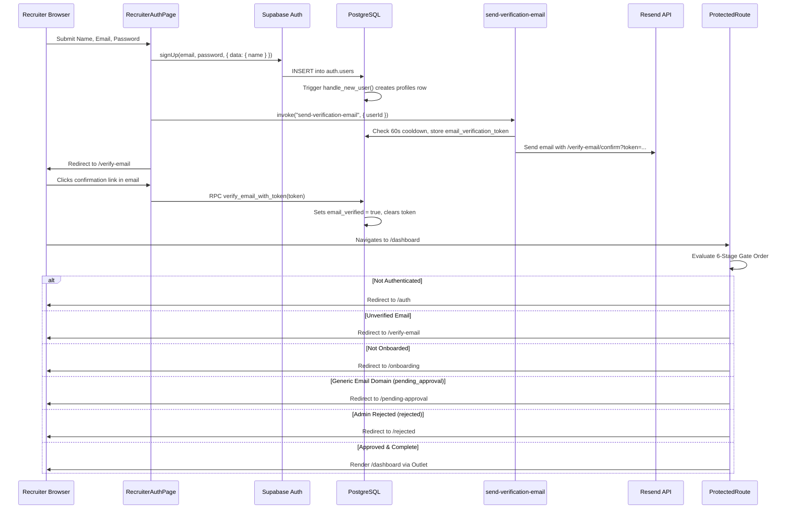
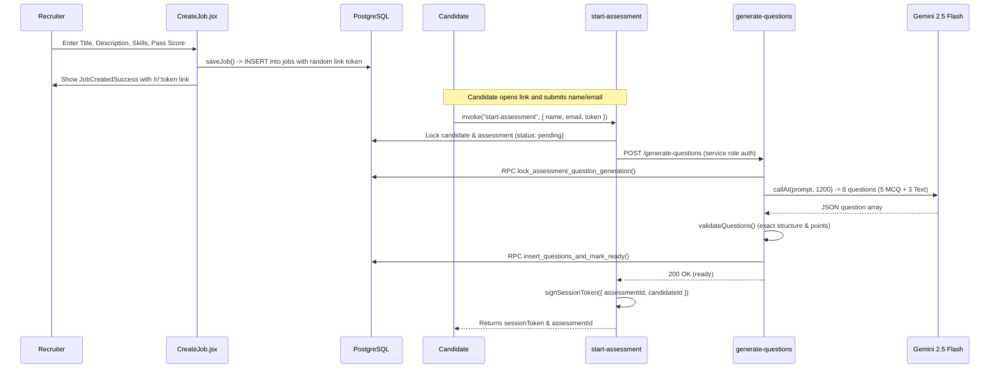
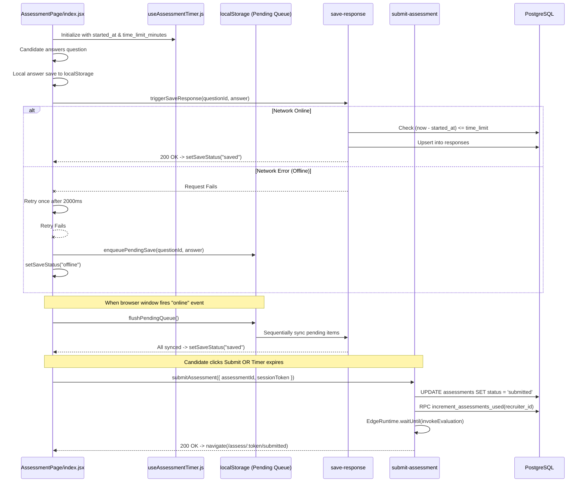
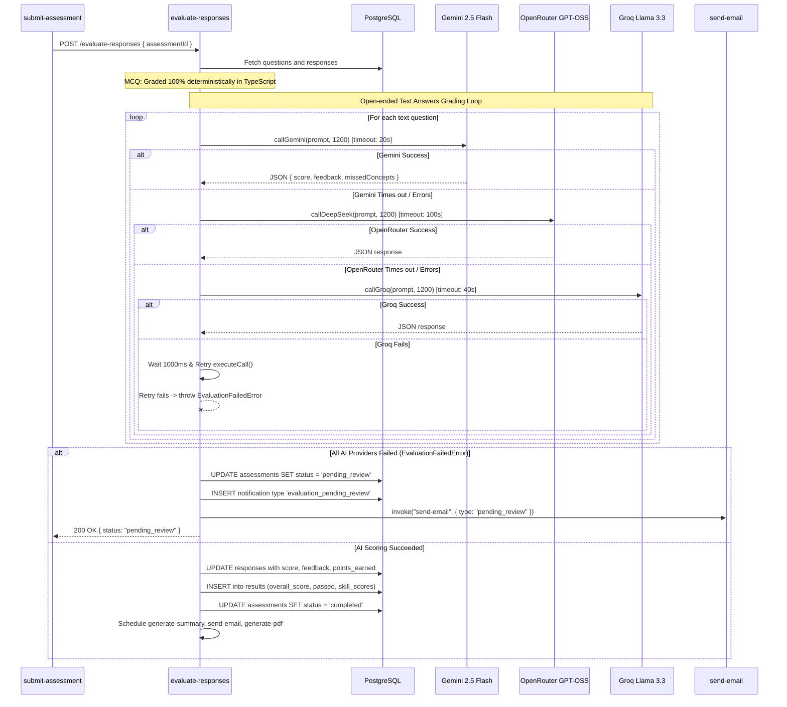
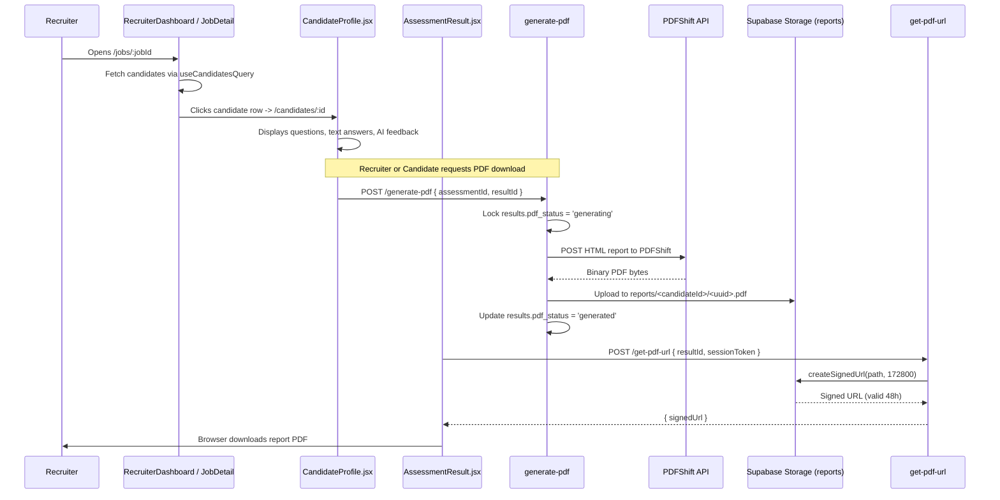
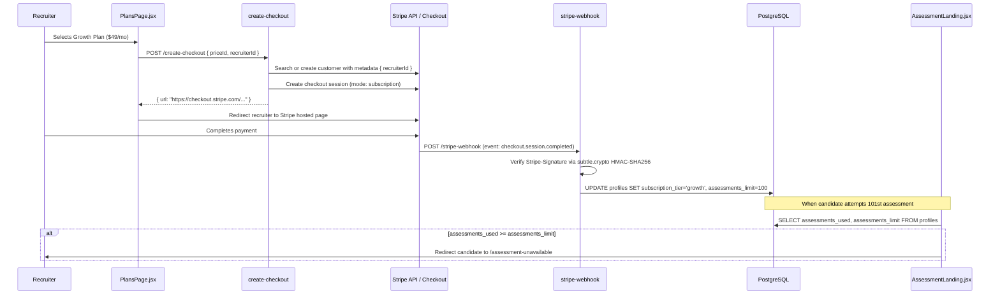
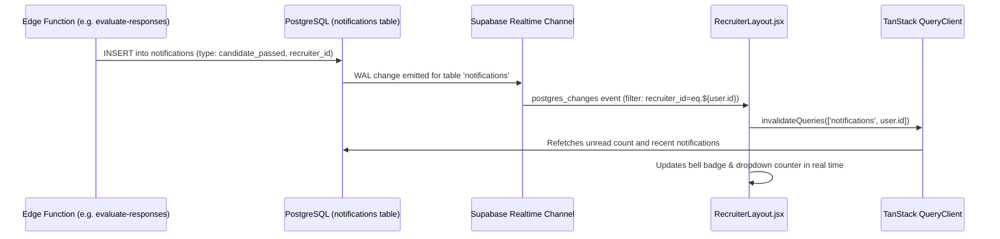
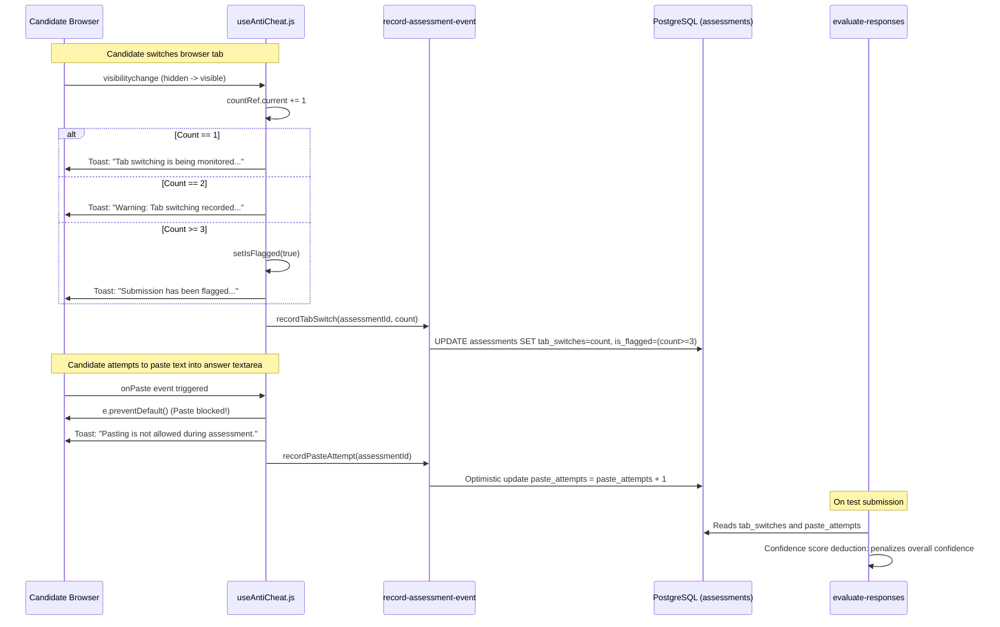

# 05. Core End-to-End System Flows

This document details the 8 primary operational workflows of SkillGate with Mermaid sequence diagrams and step-by-step code execution traces citing exact file paths and function names.

---

## Flow A: Recruiter Signup, Verification, Approval, Onboarding & Route Protection

### Architecture & Sequence Diagram



### Step-by-Step Code Trace
1. **Registration Submission**:
   * File: `src/pages/auth/RecruiterAuthPage.jsx`
   * Function: Form submit calls `register({ name, email, password })` in `src/services/auth/authService.js`.
   * Execution: Calls `supabase.auth.signUp()`.
2. **Database Trigger Execution**:
   * File: `remote_schema.sql` (Line 99: `handle_new_user()`)
   * Trigger: `AFTER INSERT ON auth.users`.
   * Logic: Inserts row into `profiles`. Evaluates email domain against generic providers array (`gmail.com`, `yahoo.com`, `outlook.com`, `hotmail.com`, `icloud.com`, `aol.com`, `protonmail.com`, `live.com`, `msn.com`).
     * If domain matches: Sets `account_status = 'pending_approval'`.
     * Otherwise: Sets `account_status = 'approved'`.
3. **Verification Email Dispatch**:
   * File: `supabase/functions/send-verification-email/index.ts`
   * Logic: Verifies caller authorization, checks if `email_verification_sent_at` was within 60 seconds (rejects with HTTP 429 if active), generates `crypto.randomUUID()`, saves token to `profiles.email_verification_token`, and calls Resend API with link `${SITE_URL}/verify-email/confirm?token=${token}`.
4. **Token Verification**:
   * File: `src/pages/auth/VerifyEmailConfirmPage.jsx`
   * Function: Reads `token` search parameter from URL and executes `supabase.rpc("verify_email_with_token", { p_token: token })`.
   * Database: `remote_schema.sql` (Line 295: `verify_email_with_token`). Verifies token exists, checks 24-hour expiration window, updates `email_verified = true`, sets `email_verified_at = now()`, and nullifies token columns.
5. **Recruiter Onboarding**:
   * File: `src/pages/auth/RecruiterOnboarding.jsx`
   * Function: Submits `company_name`, `company_website`, and `work_email` via `updateCompanyDetails()` in `src/services/auth/authService.js`, setting `is_onboarded = true`.
6. **Route Protection Gate Order (`ProtectedRoute.jsx`)**:
   * File: `src/components/ProtectedRoute.jsx`
   * Sequential evaluation order:
     1. `if (loading) return <FullscreenLoader />`
     2. `if (!isAuthenticated) return <Navigate to="/auth" replace />`
     3. `if (!isEmailVerified) return <Navigate to="/verify-email" replace />`
     4. `if (!isOnboarded) return <Navigate to="/onboarding" replace />`
     5. `if (isPendingApproval) return <Navigate to="/pending-approval" replace />`
     6. `if (isRejected) return <Navigate to="/rejected" replace />`
     7. Access granted: Returns `<Outlet />`.

---

## Flow B: Job Creation & AI Question Generation

### Architecture & Sequence Diagram



### Step-by-Step Code Trace
1. **Recruiter Creates Job**:
   * File: `src/pages/recruiter/jobs/CreateJob.jsx`
   * Function: `handleSubmit()`.
   * Execution: Generates random link token via `generateToken()` (`crypto.randomUUID()`). Calls `saveJob()` in `src/services/recruiter/createJobService.js`.
   * Database: Inserts into `jobs` with `recruiter_id`, `skills` (JSON array), `min_score_threshold`, `time_limit_minutes: 30`, and `assessment_link_token`.
2. **Candidate Initiates Assessment**:
   * File: `src/pages/assessment/AssessmentLanding.jsx`
   * Function: Submits name and email to `startAssessment()` in `src/services/assessment/assessmentService.js`.
3. **Assessment Orchestration & Locking**:
   * File: `supabase/functions/start-assessment/index.ts`
   * Logic:
     - Validates job token exists, is active, not expired, and `link_use_count < link_max_uses`.
     - Calls stored procedure `increment_job_link_use_count(p_job_id)`.
     - Upserts candidate in `candidates` table.
     - Checks if an active attempt (`pending`, `ready`, `in_progress`) exists. If so, returns that attempt.
     - If not, inserts row in `assessments` with `status: 'pending'`, `attempt_number: 1`.
4. **Internal Question Generation Invocation**:
   * File: `supabase/functions/start-assessment/index.ts` (Lines 240–260)
   * Invocation: Fetches `${SUPABASE_URL}/functions/v1/generate-questions` using `SUPABASE_SERVICE_ROLE_KEY` (bypassing platform JWT gateway).
5. **AI Question Generation Execution**:
   * File: `supabase/functions/generate-questions/index.ts`
   * Logic:
     - Acquires generation lock via RPC `lock_assessment_question_generation` (`generation_attempts = 0 -> 1`).
     - Builds prompt demanding exactly 8 questions: 5 MCQ (3 easy at 10 pts, 2 medium at 20 pts) and 3 Text (1 medium at 20 pts, 2 hard at 30 pts; total 150 pts).
     - Calls `callAI()` in `supabase/functions/_shared/ai.js`.
     - Validates returned JSON via `validateQuestions()`.
     - Calls RPC `insert_questions_and_mark_ready()` (`remote_schema.sql` L183) which bulk-inserts 8 rows into `questions` and updates `assessments.status = 'ready'`.
6. **Session Signing & Return**:
   * File: `supabase/functions/start-assessment/index.ts`
   * Logic: Waits for generation (`waitForGeneration()`), signs candidate session JWT via `signSessionToken()` in `supabase/functions/_shared/sessionToken.ts`, and returns payload to client. Client stores it in `sessionStorage` (`skillgate_assessment_session`).

---

## Flow C: Candidate Assessment Test-Taking, Timer, Autosave, Offline Queue, Resume/Restart & Submit

### Architecture & Sequence Diagram



### Step-by-Step Code Trace
1. **Test Runner Mount**:
   * File: `src/pages/assessment/AssessmentPage/index.jsx`
   * Execution: Reads session token from `sessionStorage` via `getSessionFromStorage()`. Calls `getAssessment()` in `src/services/assessment/assessmentService.js`. Populates questions and checks local storage for saved progress (`skillgate_answers_${id}`).
2. **Timer Enforcement (`useAssessmentTimer.js`)**:
   * File: `src/hooks/useAssessmentTimer.js`
   * Logic: Calculates `elapsed = (Date.now() - new Date(startedAt).getTime()) / 1000`. Derives `secondsRemaining = max(0, timeLimit * 60 - elapsed)`. Decrements every second.
   * Auto-Submit: Fires `onWarning` at 300 seconds (5 min). When `secondsRemaining <= 0`, fires `onExpire`, invoking `handleAutoSubmit()`.
3. **Autosave with Version Discarding**:
   * File: `src/pages/assessment/AssessmentPage/index.jsx` (Lines 261–334: `triggerSaveResponse`)
   * Logic: Increments `saveVersionsRef.current[questionId]`.
   * Execution: Calls `saveResponse()` in `src/services/assessment/responseService.js`.
   * Stale Discard: If user typed new characters while save was in-flight (`currentVersion < saveVersionsRef.current[questionId]`), the old response is discarded without updating UI state.
4. **Offline Queue & Reconnect Sync**:
   * File: `src/pages/assessment/AssessmentPage/index.jsx` (Lines 110–159, 194–260)
   * Offline Detection: If `saveResponse()` fails after a 2000ms retry, calls `enqueuePendingSave()`, writing `{ questionId, answer, timeTaken }` into `localStorage` (`skillgate_pending_saves_${assessmentId}`) and sets `saveStatus = "offline"`.
   * Reconnect Flush (`flushPendingQueue`): Listens for browser `window.addEventListener('online')`. Iterates through queue sequentially. If a save returns `ASSESSMENT_EXPIRED`, clears queue, shows toast, and submits assessment immediately.
5. **Crash Recovery & Resume/Restart Modal**:
   * File: `src/pages/assessment/AssessmentPage/ResumeOrRestartModal.jsx`
   * Logic: If a candidate refreshes or crashes while status is `'in_progress'` and answers exist in storage:
     * **Resume:** Closes modal, recalculates timer against original `started_at`, and flushes any pending saves.
     * **Restart:** Calls `restartAssessment()` in `src/services/assessment/assessmentService.js` $\rightarrow$ `restart-assessment` Edge Function. The function deletes prior responses, sets `attempt_number = 2`, and clears `started_at`.
6. **Submission Execution**:
   * File: `src/pages/assessment/AssessmentPage/index.jsx` (`doSubmit`) $\rightarrow$ `supabase/functions/submit-assessment/index.ts`
   * Logic:
     - Validates session token matches `candidate_id` and `assessment_id`.
     - Atomically updates status from `ready`/`in_progress` to `submitted`.
     - Atomically executes RPC `increment_assessments_used(recruiter_id)`.
     - Schedules `evaluate-responses` in the background using `EdgeRuntime.waitUntil`.
     - Returns `200 OK` to candidate browser; navigates to `/assess/:token/submitted`.

---

## Flow D: AI Evaluation, Scoring, Fallback Chain & Failure Escalation

### Architecture & Sequence Diagram



### Step-by-Step Code Trace
1. **Deterministic MCQ Scoring**:
   * File: `supabase/functions/evaluate-responses/index.ts` (Lines 395–426)
   * Logic: Code compares `response.answer_given.trim().toLowerCase()` with `question.correct_answer.trim().toLowerCase()`. If matched, `score = 1`, `points_earned = question.points`, `isCorrect = true`. Zero LLM tokens consumed.
2. **Text Answer Rubric Scoring**:
   * File: `supabase/functions/evaluate-responses/index.ts` (Lines 290–381)
   * Execution: Builds rubric prompt containing question, ideal answer, candidate answer, and rules (score 0.0 to 1.0, penalize keyword stuffing, `isCorrect = true` only if `score >= 0.7`).
3. **AI Provider Fallback Loop (`_shared/ai.js`)**:
   * Attempt 1: Gemini 2.5 Flash with 20s timeout.
   * If aborted/failed: Fallback 1 to OpenRouter `openai/gpt-oss-120b:free` with 100s timeout.
   * If aborted/failed: Fallback 2 to Groq `llama-3.3-70b-versatile` with 40s timeout.
4. **Retry Loop on JSON Parse Failure**:
   * If AI returns malformed JSON, function logs warning, pauses 1000ms, and re-executes `executeCall()`.
5. **Escalation to Manual Review**:
   * File: `supabase/functions/evaluate-responses/index.ts` (Lines 719–792)
   * Logic: If both execution attempts fail, throws `EvaluationFailedError`.
   * Escalation Actions:
     1. Updates `assessments.status = 'pending_review'`.
     2. Inserts notification row in `notifications` with `type: 'evaluation_pending_review'`.
     3. Invokes `send-email` Edge Function with `{ type: 'pending_review' }` to alert the recruiter.
     4. Returns HTTP 200 `{ status: "pending_review" }` to prevent client timeouts.
6. **Result Persistence & Background Cascades**:
   * On success: Updates `responses` rows with earned points and feedback.
   * Inserts into `results` table: calculates percentage `overall_score`, checks `passed = overall_score >= job.min_score_threshold`, applies anti-cheat penalties to `confidence_score`.
   * Updates `assessments.status = 'completed'`.
   * Asynchronously triggers `generate-summary`, `send-email`, and `generate-pdf`.

---

## Flow E: Recruiter Dashboard, Candidate Review & PDF Export

### Architecture & Sequence Diagram



### Step-by-Step Code Trace
1. **Recruiter Reviews Candidate Results**:
   * File: `src/pages/recruiter/candidates/CandidateProfile.jsx`
   * Logic: Loads assessment data, score, pass state, question breakdown, and anti-cheat indicators (`tab_switches`, `paste_attempts`, `is_flagged`).
   * Manual Actions: Supports manual status change (`shortlisted`, `rejected`), evaluation retry (line 55 calls `evaluate-responses`), and PDF re-generation.
2. **PDF Generation Lock & HTML Render**:
   * File: `supabase/functions/generate-pdf/index.ts`
   * Lock: Updates `results.pdf_status = 'generating'`, `pdf_generation_started_at = now()`. Enforces 10-minute stale lock timeout.
   * HTML Generation: Compiles candidate details, score pill, threshold comparison, skill table, feedback summary, and strengths/weaknesses into an inline-styled HTML string (`buildHtmlReport()`).
3. **PDFShift Conversion & Storage**:
   * File: `supabase/functions/generate-pdf/index.ts` (Lines 800–885)
   * Execution: Sends HTML to `https://api.pdfshift.io/v3/convert/pdf` with 30s timeout.
   * Upload: Binary buffer uploaded to `reports` Supabase Storage bucket at path `${candidate_id}/${crypto.randomUUID()}.pdf`.
   * Update: Updates `results.pdf_status = 'generated'`, `results.pdf_storage_path`.
4. **Auto-Retry on PDF Failure**:
   * If PDFShift fails, checks `pdf_generation_attempts`. If $< 1$, increments attempts, pauses 2000ms, and re-invokes `generate-pdf` (`isAutoRetry: true`). If retry fails, marks `pdf_status = 'failed'` and sends `pdf_generation_failed` notification to recruiter.
5. **Signed PDF Delivery**:
   * File: `supabase/functions/get-pdf-url/index.ts`
   * Logic: Validates candidate session token, checks that assessment matches result, and calls `supabase.storage.from("reports").createSignedUrl(storagePath, 172800)` (48 hours).

---

## Flow F: Stripe Checkout, Subscription Quotas & Webhook Lifecycle

### Architecture & Sequence Diagram



### Step-by-Step Code Trace
1. **Recruiter Selects Plan**:
   * File: `src/pages/recruiter/billing/PlansPage.jsx`
   * Execution: Calls `createCheckoutSession(priceId, recruiterId)` in `src/services/recruiter/billingService.js`.
2. **Checkout Session Creation**:
   * File: `supabase/functions/create-checkout/index.ts`
   * Logic: Authenticates user JWT, verifies `user.id === recruiterId`, checks `profiles.stripe_customer_id`. If missing, searches Stripe via `/customers/search` by email, or creates a customer. Calls Stripe `/checkout/sessions` with `subscription` mode and `client_reference_id = recruiterId`. Returns checkout URL.
3. **Cryptographic Webhook Ingestion**:
   * File: `supabase/functions/stripe-webhook/index.ts`
   * Verification: Extracts `Stripe-Signature` (`t` and `v1`). Enforces 300-second timestamp drift limit. Computes HMAC-SHA256 using `crypto.subtle` and validates using `timingSafeCompare()`.
4. **Subscription Tier Updates**:
   * Handles `checkout.session.completed`:
     * Matches price ID to plan tier: Starter $\rightarrow$ 10 limit, Growth $\rightarrow$ 100 limit, Scale $\rightarrow$ 500 limit.
     * Updates `profiles.subscription_tier`, `profiles.assessments_limit`, and `profiles.stripe_customer_id`.
   * Handles candidate roadmap payments ($9.00):
     * Mode: `payment`. Inserts record into `training_purchases` with `status: 'completed'`.
   * Handles `customer.subscription.deleted`:
     * Downgrades recruiter to `subscription_tier = 'starter'`, `assessments_limit = 10`.
   * Handles `invoice.payment_failed`:
     * Looks up recruiter email and calls `send-email` with payment failure template.
5. **Client-Side Plan Quota Enforcement**:
   * File: `src/pages/assessment/AssessmentLanding.jsx` (Lines 110–135)
   * Enforcement: Queries `assessments_used` and `assessments_limit` from `profiles`. If `used >= limit`, immediately redirects candidate to `/assessment-unavailable`.

---

## Flow G: Real-Time Notifications

### Architecture & Sequence Diagram



### Step-by-Step Code Trace
1. **Notification Creation**:
   * Edge Functions insert alert records directly into `notifications`:
     * `candidate_passed` / `candidate_failed`: Dispatched on evaluation completion.
     * `evaluation_pending_review`: Dispatched when AI evaluation exhausts retries.
     * `pdf_generation_failed`: Dispatched when PDFShift retries fail.
     * `email_failed`: Dispatched when Resend retries fail.
2. **Realtime Subscription Mounting**:
   * File: `src/layouts/RecruiterLayout.jsx` (Lines 382–408)
   * Channel Configuration:
     ```javascript
     const channel = supabase
       .channel(`notifications:${user.id}`)
       .on('postgres_changes', {
         event: '*',
         schema: 'public',
         table: 'notifications',
         filter: `recruiter_id=eq.${user.id}`,
       }, () => {
         queryClient.invalidateQueries({ queryKey: ['notifications', user.id] });
       })
       .subscribe();
     ```
3. **Visibility Reconciliation**:
   * When user switches back to the tab (`document.visibilityState === 'visible'`), React Query automatically invalidates notification queries to catch up on alerts missed while inactive.
4. **Optimistic Mark-as-Read Mutations**:
   * File: `src/hooks/queries/useNotificationsQuery.js`
   * When recruiter marks an alert as read, TanStack Query updates local cache immediately via `onMutate` before sending the database update to `notificationService.markOneAsRead()`.

---

## Flow H: Anti-Cheat Telemetry (Tab Switch & Paste Prevention)

### Architecture & Sequence Diagram



### Step-by-Step Code Trace
1. **Tab Switch Monitoring**:
   * File: `src/hooks/useAntiCheat.js`
   * Logic: Mounts `document.addEventListener('visibilitychange')`.
   * Flags `wasHiddenRef.current = true` when hidden; when visible again, increments `countRef.current`.
   * Feedback:
     * Switch 1: Information toast (Integrity warning).
     * Switch 2: Error toast (Warning of flagging).
     * Switch 3+: Error toast (Alerts candidate that submission is flagged) and sets `isFlagged = true`.
   * Dispatch: Calls `recordTabSwitch(assessmentId, newCount)` in `src/services/assessment/responseService.js`.
2. **Paste, Copy & Cut Interception**:
   * File: `src/hooks/useAntiCheat.js` (Lines 59–88)
   * Logic: Exports `disablePaste` object (`{ onPaste, onCopy, onCut }`).
   * Applied directly to `TextQuestion.jsx` textarea.
   * Invokes `e.preventDefault()`, displays toast error, and dispatches `recordPasteAttempt(assessmentId)`.
3. **Database Telemetry Recording**:
   * File: `supabase/functions/record-assessment-event/index.ts`
   * Updates `assessments.tab_switches` and enforces `is_flagged = count >= 3`.
   * Updates `assessments.paste_attempts` using an optimistic concurrency loop (up to 3 retries) to prevent counter overwrite.
4. **Scoring Confidence Penalty**:
   * File: `supabase/functions/evaluate-responses/index.ts`
   * During evaluation, `confidence_score` starts at 100% and is progressively penalized for recorded tab switches and paste attempts, labeling confidence as `High`, `Medium`, or `Low` in `results.confidence_label`.
